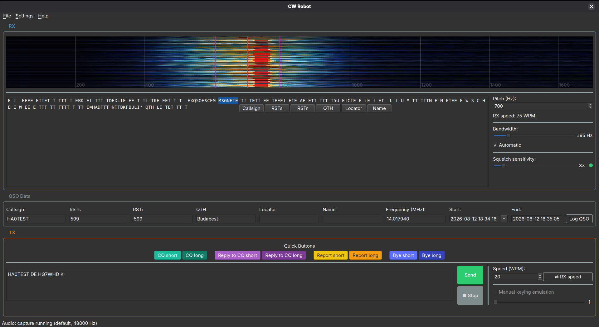

# CW Robot

A desktop CW (Morse) transceiver application: decode the CW you receive
over your radio's audio, and send CW back — either as an audio sidetone or
via Hamlib CAT keying — straight from your computer.



## Usage

See [USAGE.md](USAGE.md) for a quick rundown of the controls (RX, TX,
macros, QSO logging).

## Features

- **Receive** — waterfall display, an adaptive Goertzel-based decoder that
  tracks variable/hand-keyed sending speed, adjustable squelch and
  detection bandwidth (automatic or manual), a tunable pitch reference to
  match your radio's sidetone.
- **Transmit** — audio-tone sidetone output or Hamlib CAT keying,
  adjustable speed with a one-click "match RX speed" shortcut, manual-
  keying jitter emulation, eight customizable quick-text macro buttons
  (CQ, reply, report, sign-off — short/long variants).
- **QSO logging** — one click logs the current contact to an ADIF file
  (one growing file per operator callsign) or sends it live over UDP,
  either as a bare ADIF record (for Log4OM-style listeners) or framed as a
  WSJT-X Network Message ("Logged ADIF"), which QLog, JTAlert, GridTracker
  and others also understand.
- **Hamlib CAT** — rig model picker searchable across the ~300 models
  Hamlib supports, serial port autodetection, live VFO frequency polling
  on its own background thread (so it won't freeze the UI even if the
  radio is off or disconnected), and a one-click connection test.
- Picks up any input/output PipeWire or PulseAudio exposes, not just plain
  ALSA hardware devices — including another application's monitor/sink as
  an RX source.

## Download

The easiest way to run CW Robot is a prebuilt package from the
[Releases page](https://github.com/dacrhu/cwrobot/releases) — each one
bundles its own Python, PySide6/Qt6, and Hamlib, so nothing needs to be
installed first.

**Linux — AppImage** (the primary, most-tested platform):

```sh
chmod +x CW_Robot-x86_64.AppImage
./CW_Robot-x86_64.AppImage
```

It's built on a recent Ubuntu/Fedora glibc, so it should run on most
current Linux distros; if it doesn't start on yours, please open an issue.
PipeWire device routing still needs `pactl` on the host (see "Audio
handling" below) — everything else is self-contained. See
`packaging/build_appimage.sh` if you'd rather build it yourself.

**Windows and macOS (Apple Silicon) — beta.** Built the same way in CI
(`.github/workflows/windows-macos-build.yml`, PyInstaller-based) and
verified there with an automated startup smoke test on real Windows/macOS
GitHub Actions runners, but nobody on this project has Windows/Mac
hardware to test on by hand yet — reports of what does or doesn't work are
very welcome. On macOS, the app is unsigned (ad-hoc signed only), so
Gatekeeper will block the first launch: right-click → Open, or run
`xattr -d com.apple.quarantine "CW Robot.app"`.

## Requirements

- Linux (the most-tested platform). Windows and macOS (Apple Silicon)
  builds are available too — see "Download" above — but are new and less
  battle-tested; `pyserial`, the one OS-facing dependency besides
  audio/Qt, is cross-platform, so this should keep working, but
  reports/contributions are welcome either way.
- Python 3.11+
- [Hamlib](https://hamlib.github.io/) (`libhamlib.so` / `.dll` / `.dylib`)
  — only needed for CAT keying; audio-tone TX and RX work fine without it.
  Bundled already in every prebuilt package above; only relevant if you're
  running from source.

## Installation (Fedora)

Just want to run the app? Grab the prebuilt AppImage from the
[Releases page](https://github.com/dacrhu/cwrobot/releases) instead — see
"Download" above. The rest of this section is for running from source or
contributing.

The project relies on system packages where it can (PySide6, numpy, scipy)
and only pulls the awkward-to-package dependencies (`sounddevice`) into the
virtual environment via pip:

```sh
sudo dnf install python3-pyside6 hamlib hamlib-devel python3-pyserial
python3 -m venv --system-site-packages .venv
source .venv/bin/activate
pip install -e ".[dev]"
```

(`hamlib-devel` is only needed at development time, as a header reference
for `<hamlib/rig.h>` — at runtime, the `hamlib` package's `libhamlib.so` is
enough; see below.)

`--system-site-packages` matters here because Fedora's `python3-pyside6`
package is tightly tied to the system's own Qt6 install (platform plugins,
themes) — a separate pip-installed PySide6 wheel would conflict with it.

### Audio handling (PipeWire/PulseAudio)

The PortAudio build shipped by every current distro has no PulseAudio
hostAPI, so PipeWire's own virtual/monitor sources and sinks don't show up
directly in `sd.query_devices()`. CW Robot doesn't work around this by
writing ALSA config (no `~/.config/alsa/asoundrc` or `conf.d/*.conf`
poking) — instead it uses `pactl`'s PulseAudio-compatible protocol: the
stream always opens on the safe ALSA "default" device, then at startup the
app runs `pactl move-sink-input` / `pactl move-source-output` to move its
own stream onto the selected PipeWire sink/source afterward (see
`cwrobot/audio/pipewire_route.py`). This needs the `pactl` binary to be
available (Fedora's `pipewire-pulseaudio` package provides it) — if it's
missing, or PipeWire isn't running, that specific selection just isn't
available; every other device still works normally.

### Hamlib CAT keying

CAT keying only needs the `hamlib` package's shared library
(`libhamlib.so`) at runtime — `ctypes` loads it directly, no compilation
or `hamlib-devel` headers required (those are only useful at development
time, as a `<hamlib/rig.h>` reference; see `cwrobot/hamlib/
ctypes_bindings.py`'s module docstring for why Hamlib's internal struct
layouts never need to be probed). If `libhamlib.so` isn't present on the
system, the CAT feature disables itself with a clear error message —
receive and audio-tone TX keep working normally regardless.

The Settings dialog's "TX" tab also offers a live-queried serial port
dropdown (via `pyserial`, see `cwrobot/hamlib/serial_ports.py`); the field
stays editable too, for when the radio isn't plugged in yet or is on an
unusual path. `pyserial` itself is cross-platform (Linux/Windows/macOS),
so port listing should work under Windows too, with no OS-specific code.

### Building the AppImage

```sh
./packaging/build_appimage.sh
```

Downloads a portable, prebuilt CPython AppImage
([niess/python-appimage](https://github.com/niess/python-appimage)), pip
installs CW Robot and its dependencies into it, copies this machine's
`libhamlib.so` (plus its own transitive shared-library dependencies) in
alongside it, and packs the result with `appimagetool` (must be on
`PATH`) into `dist/CW_Robot-x86_64.AppImage`. See the script's own
comments for the exact steps and the current portability caveat (the
bundled Hamlib is linked against whatever glibc this build machine has).
A GitHub Actions workflow (`.github/workflows/appimage.yml`) runs the same
script and attaches the result to the GitHub Release on every tag push.

### Building the Windows/macOS packages

These aren't built with a single standalone script the way the AppImage
is — `.github/workflows/windows-macos-build.yml` runs
[PyInstaller](https://pyinstaller.org/) against `packaging/cwrobot.spec`
directly, bundling in a Hamlib runtime for each platform
(`packaging/bundle_hamlib_macos.sh` re-links a Homebrew-installed copy on
macOS, then the workflow ad-hoc re-signs the whole bundle; Windows
downloads Hamlib's own official prebuilt zip). See that workflow file's
comments for the full sequence, including the `--smoke-test`-based
verification (`cwrobot.app`/`cwrobot.hamlib.ctypes_bindings`) that runs on
every build.

## Running

```sh
cwrobot
```

(installed as a console script by `pip install -e .`) or, without
installing it as a script:

```sh
python -m cwrobot.app
```

## Configuration

Settings are stored as human-readable JSON at
`$XDG_CONFIG_HOME/cwrobot/config.json` (typically
`~/.config/cwrobot/config.json`) — deliberately not `QSettings`, so the
file stays easy to read or hand-edit, and carries an explicit schema
version so it can be migrated forward cleanly as settings are added (see
`cwrobot/config.py`).

## Tests

```sh
pytest
```

## License

MIT.
